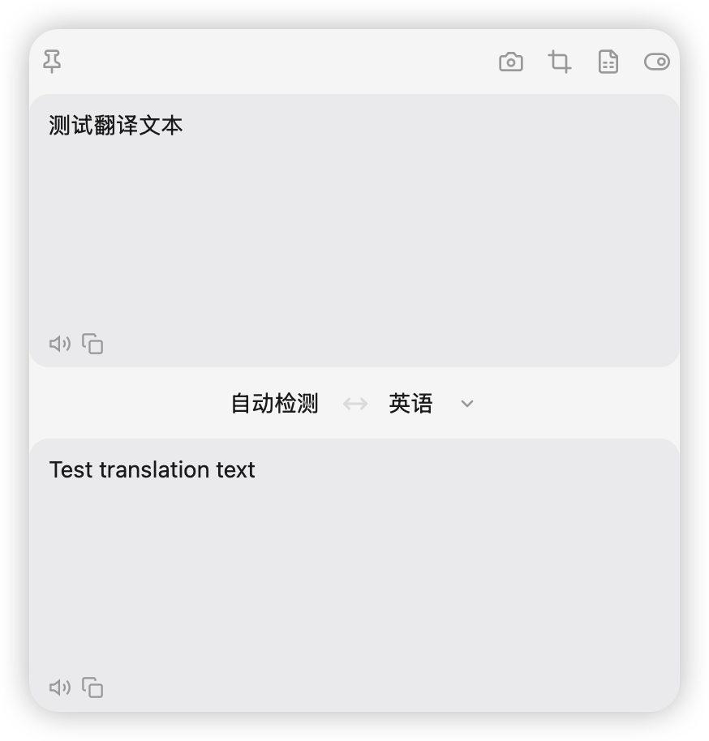
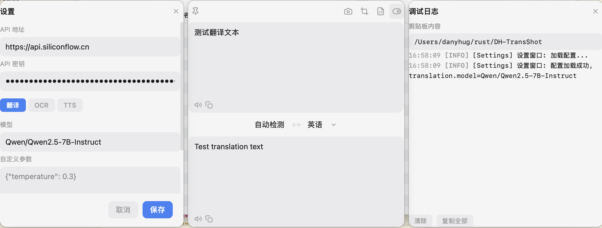

# DH-TransShot

截屏+翻译二合一桌面工具，支持 macOS 和 Windows。**本项目由 Vibe Coding 驱动开发。**


## 截图预览

| 翻译主界面 | 设置 & 调试日志 |
|:---:|:---:|
|  |  |

## 功能特性

- **区域截图** — 快捷键框选屏幕区域，自动裁切并复制到剪贴板
- **区域翻译** — 框选区域 → OCR 识别 → 翻译，一键完成
- **OCR 识别** — 系统原生引擎（macOS Vision / Windows Media.Ocr），无需额外安装
- **多语言翻译** — 支持 14 种语言互译，包含中/英/日/韩/法/德/西/葡/俄/阿拉伯/意/泰/越南语
- **OpenAI 兼容接口** — 支持 OpenAI、DeepSeek、Ollama、SiliconFlow 等任意兼容服务
- **TTS 朗读** — 支持对翻译结果进行语音朗读
- **深色/浅色主题** — 跟随系统自动切换
- **系统托盘** — 后台常驻，随时唤起
- **多服务独立配置** — 翻译、OCR、TTS 各服务可分别配置 API 地址、密钥和模型

## 快捷键

| 快捷键 | 功能 |
|--------|------|
| `Alt+A`（macOS `⌥A`） | 区域截图 — 框选 → 裁切 → 复制到剪贴板 |
| `Alt+S`（macOS `⌥S`） | 区域翻译 — 框选 → OCR → 翻译 → 显示结果 |

## 安装

### 从 Release 下载

前往 [Releases](../../releases) 页面下载对应平台安装包：

- **macOS**: `.dmg` 安装包
- **Windows**: `.msi` 安装包

> macOS 用户首次使用需在「系统设置 → 隐私与安全性 → 屏幕录制」中授予权限。

### 从源码构建

```bash
# 克隆仓库
git clone https://github.com/danyhug/DH-TransShot.git
cd DH-TransShot

# 安装前端依赖
pnpm install

# 开发模式运行
pnpm tauri dev

# 构建生产版本
pnpm tauri build
```

## 开发指南

### 环境要求

- [Rust](https://rustup.rs/) (stable)
- [Node.js](https://nodejs.org/) >= 18
- [pnpm](https://pnpm.io/)
- macOS: Xcode Command Line Tools
- Windows: Visual Studio C++ Build Tools

### 常用命令

```bash
pnpm tauri dev          # 开发模式运行
pnpm tauri build        # 构建生产版本
pnpm exec tsc --noEmit  # TypeScript 类型检查
pnpm exec vite build    # 仅构建前端
cargo check             # 仅检查 Rust 编译（需在 src-tauri/ 目录下）
```

### 环境变量

复制 `.env.test` 为 `.env`，填入实际的 API 配置：

```bash
cp .env.test .env
```

## 项目结构

```
src-tauri/src/
├── lib.rs                # Tauri 入口
├── commands/             # Tauri 命令层（前后端 RPC 接口）
│   ├── screenshot.rs     # 截图命令
│   ├── ocr.rs            # OCR 命令
│   ├── translation.rs    # 翻译命令
│   └── settings.rs       # 设置命令
├── screenshot/           # 截图捕获（xcap）
├── ocr/                  # OCR（macOS Vision / Windows Media.Ocr）
├── translation/          # LLM 翻译（OpenAI 兼容接口）
├── config/               # 配置与全局状态
├── tray.rs               # 系统托盘
└── hotkey.rs             # 全局快捷键

src/
├── App.tsx               # 主窗口编排
├── ScreenshotApp.tsx     # 截图覆盖层
├── components/           # UI 组件
├── hooks/                # 业务逻辑 Hooks
├── stores/               # Zustand 状态管理
├── lib/                  # 工具函数
├── types/                # TypeScript 类型
└── styles/               # 全局样式
```

## 技术栈

| 层 | 技术 |
|---|---|
| 后端运行时 | Rust + Tauri v2 + Tokio |
| 前端框架 | React 19 + TypeScript |
| 样式 | Tailwind CSS v4 + CSS 变量主题 |
| 状态管理 | Zustand |
| 截图 | xcap |
| OCR | macOS Vision / Windows Media.Ocr（系统原生） |
| 翻译 | OpenAI 兼容 Chat Completions API |
| 构建 | Vite + Cargo |
| 包管理 | pnpm |

## 许可证

[MIT License](LICENSE)
