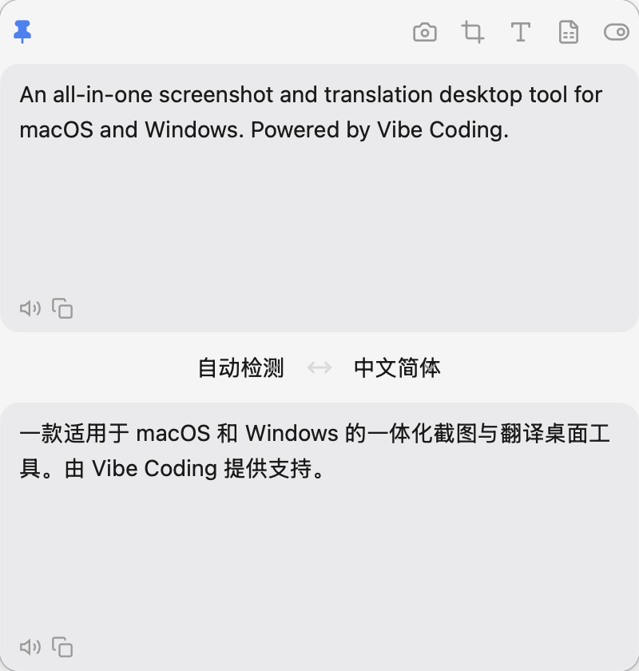
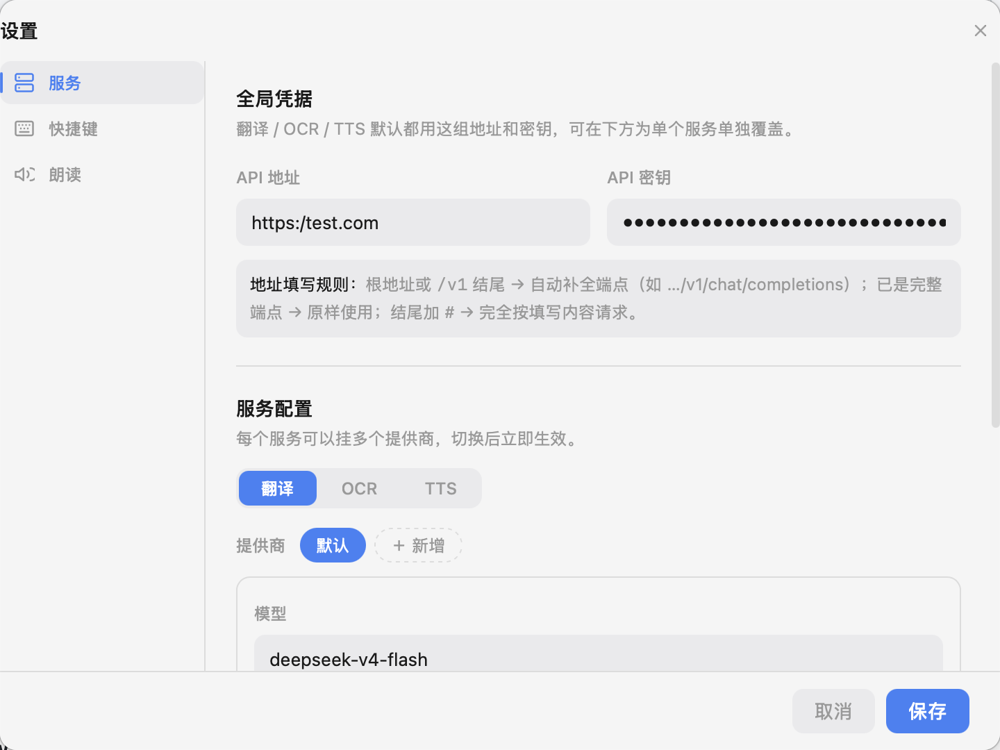
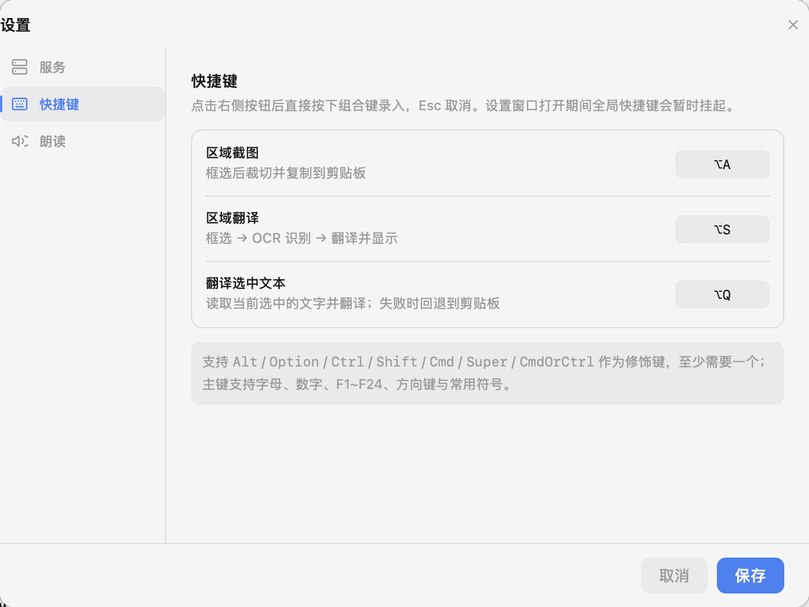
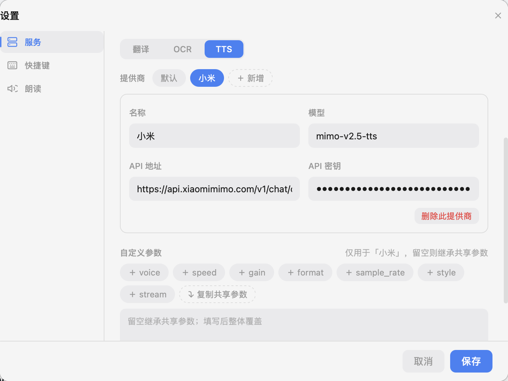
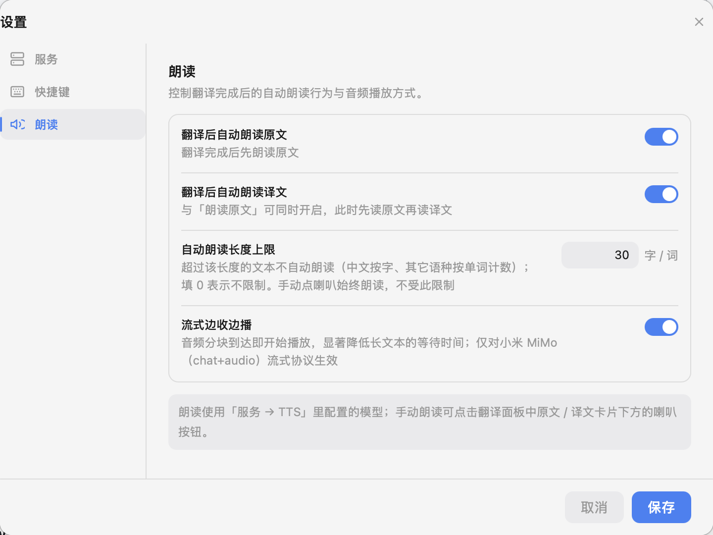
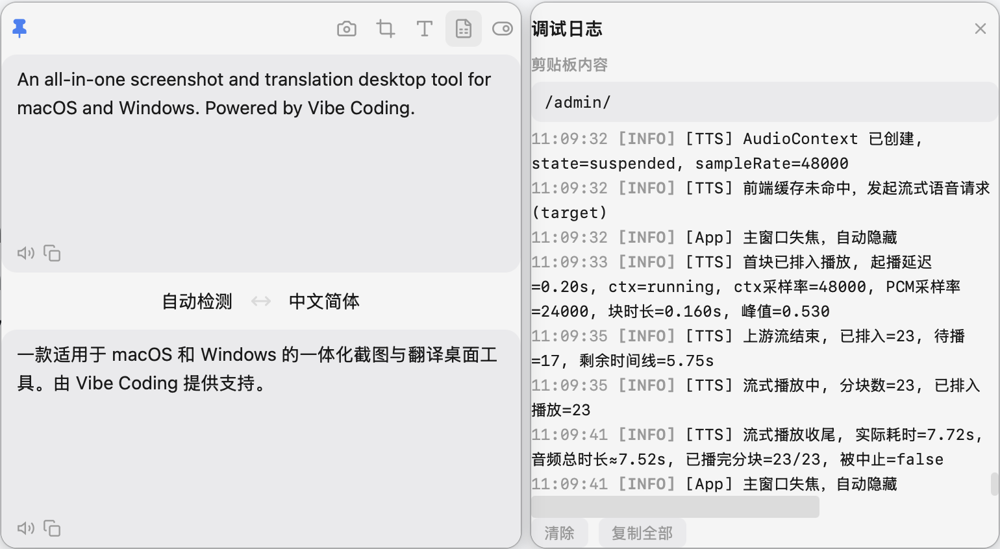

# DH-TransShot

[English](README_EN.md)

截屏 + 翻译二合一桌面工具，支持 macOS 和 Windows。**本项目由 Vibe Coding 驱动开发。**


一个常驻托盘的小窗口：按下快捷键框选屏幕，截图直接进剪贴板；或者让视觉模型读出框选区域里的文字，翻译好再显示出来。翻译、OCR、TTS 三条链路都走 OpenAI 兼容接口，可以各自接不同的服务商。

## 截图预览

### 主界面



窗口置顶、语言互换、原文/译文各自的朗读与复制按钮；标题栏五个图标依次是区域截图、区域翻译、翻译剪贴板、调试日志、设置。

### 设置

| 服务配置 | 快捷键 |
|:---:|:---:|
|  |  |

| TTS 多提供商 | 朗读行为 |
|:---:|:---:|
|  |  |

### 调试日志窗口



## 功能特性

### 截图与标注

- **区域截图** — 快捷键框选屏幕区域，自动裁切并复制到剪贴板
- **多显示器** — 每块屏幕独立按原生分辨率截取，覆盖层同时铺满所有显示器
- **窗口自动识别** — 框选前把鼠标移到某个窗口上，会自动吸附出该窗口的边界，一次点击即可选中整窗
- **标注模式** — 框选后进入标注，支持矩形、箭头、画笔、**马赛克**、文字五种工具；可自定义颜色（含预设色板与取色）、线宽、字号与加粗
- **取色器** — 框选阶段鼠标悬停实时显示颜色值，按 `C` 复制 HEX 到剪贴板
- **保存到文件** — 标注完成后除了复制到剪贴板，也可以直接下载为图片

### 翻译

- **区域翻译** — 框选区域 → 视觉模型 OCR → 翻译，一步完成
- **翻译选中文本** — 快捷键直接翻译当前选中的文字（macOS 走 Accessibility API，失败时回退到剪贴板模拟）
- **翻译剪贴板** — 标题栏一键翻译剪贴板中的文本
- **15 种语言** — 自动检测源语言，可译到中文简体/繁體、英、日、韩、法、德、西、葡、俄、阿拉伯、意、泰、越南语

### 朗读（TTS）

- **手动朗读** — 原文与译文各有独立的朗读按钮
- **自动朗读** — 可分别开启「翻译后自动朗读原文 / 译文」，并设置长度上限（中文按字、西文按单词计数，`0` 表示不限制；只约束自动朗读，手动点击始终朗读）
- **双协议支持** — 标准 `audio/speech` 接口，以及小米 MiMo 式 `chat+audio` 协议（含语速标签 prefix）
- **流式边收边播** — chat+audio 协议下音频分块实时推给前端播放，不必等整段合成完；可在设置里关闭
- **音频缓存** — 同一段文本重复朗读直接命中缓存，按条数与总字节双上限淘汰

### 配置

- **全局凭据 + 多提供商** — 翻译 / OCR / TTS 三个服务各自维护一组提供商，未单独填写的字段回退到全局 API 地址与 Key
- **地址自适应拼接** — 填根地址自动补 `/v1/xxx`，填到版本段保留你的版本号，填完整端点原样使用，结尾加 `#` 则完全按原文请求
- **自定义参数** — 每个提供商可写一段 JSON 覆盖请求体（`temperature`、`max_tokens`、`voice`、`speed`、`response_format` 等），TTS 面板还提供常用参数的快捷插入
- **快捷键自定义** — 三个全局快捷键均可在设置中录入，保存后立即生效，无需重启
- **调试日志窗口** — 独立窗口实时查看前后端日志，支持清除与一键复制
- **深色 / 浅色主题** — 跟随系统自动切换
- **系统托盘** — 后台常驻，托盘菜单可直接触发三个功能

## 快捷键

默认快捷键如下，均可在「设置 → 快捷键」中修改：

| 快捷键 | 功能 |
|--------|------|
| `Alt+A`（macOS `⌥A`） | 区域截图 — 框选 → 标注 → 复制到剪贴板 |
| `Alt+S`（macOS `⌥S`） | 区域翻译 — 框选 → OCR → 翻译 → 显示结果 |
| `Alt+Q`（macOS `⌥Q`） | 翻译选中文本 — 读取选中文字 → 翻译 → 显示结果 |

> 修饰键支持 `Alt` / `Option` / `Ctrl` / `Shift` / `Cmd` / `Super` / `CmdOrCtrl`（至少一个），主键支持字母、数字、`F1~F24`、方向键与常用符号。设置窗口打开期间全局快捷键会暂时挂起，方便录入。

### 截图标注操作

| 按键 | 工具 |
|------|------|
| `1` | 矩形 |
| `2` | 箭头 |
| `3` | 画笔 |
| `4` | 马赛克 |
| `5` | 文字（点击画布输入，`Enter` 确认） |

其他操作：`Ctrl+Z` / `Cmd+Z` 撤销、`Enter` 确认截图、`Esc` 取消、框选阶段按 `C` 复制悬停处颜色。工具栏右侧可调整颜色、线宽 / 字号，并提供确认、取消、下载三个按钮。

## 安装

### 从 Release 下载

前往 [Releases](../../releases) 页面下载对应平台安装包：

- **macOS**：`.dmg`
- **Windows**：`.msi`

> macOS 首次使用需在「系统设置 → 隐私与安全性」中授权：
> - **屏幕录制** — 区域截图与 OCR 需要
> - **辅助功能** — 「翻译选中文本」（`⌥Q`）读取选中文字需要

### 从源码构建

```bash
git clone https://github.com/danyhug/DH-TransShot.git
cd DH-TransShot

pnpm install       # 安装前端依赖
pnpm tauri dev     # 开发模式运行
pnpm tauri build   # 构建生产版本
```

## 快速配置

首次启动后打开「设置 → 服务」：

1. **全局凭据** 填入 API 地址与 API Key（默认指向 [SiliconFlow](https://siliconflow.cn/)）
2. **服务配置** 分别为翻译 / OCR / TTS 选择模型；默认值：
   - 翻译：`tencent/Hunyuan-MT-7B`
   - OCR：`Qwen/Qwen3.5-4B`（需为视觉模型）
   - TTS：`FunAudioLLM/CosyVoice2-0.5B`
3. 需要混用不同服务商时，在对应服务下「新增」一个提供商，只填要覆盖的字段即可

任何 OpenAI 兼容服务都可以接入：OpenAI、DeepSeek、SiliconFlow、Ollama、以及小米 MiMo（TTS 走 chat+audio 协议）等。

## 开发指南

### 环境要求

- [Rust](https://rustup.rs/)（stable）
- [Node.js](https://nodejs.org/) >= 18
- [pnpm](https://pnpm.io/)
- macOS：Xcode Command Line Tools
- Windows：Visual Studio C++ Build Tools

### 常用命令

```bash
pnpm tauri dev          # 开发模式运行
pnpm tauri build        # 构建生产版本
pnpm exec tsc --noEmit  # TypeScript 类型检查
pnpm exec vite build    # 仅构建前端
cargo check             # 仅检查 Rust 编译（在 src-tauri/ 目录下）
cargo test              # 运行 Rust 单元测试（在 src-tauri/ 目录下）
```

### 环境变量

复制 `.env.test` 为 `.env`，填入默认的 API 配置（`DEFAULT_BASE_URL` / `DEFAULT_API_KEY`），会作为首次启动时的默认值：

```bash
cp .env.test .env
```

### 发版

版本号以 git tag 为准，不要手改单个版本文件：

```bash
pnpm release          # patch
pnpm release:minor    # minor
pnpm release:major    # major
git push && git push origin v<版本号>
```

推送 tag 后由 GitHub Actions 同步各版本文件并打包。

## 项目结构

```
src-tauri/src/
├── lib.rs                # Tauri Builder 入口
├── main.rs               # 程序入口
├── api_client.rs         # 共享 HTTP 客户端与端点拼接
├── commands/             # Tauri 命令层（前后端 RPC 接口）
│   ├── screenshot.rs     # 截图 / 多显示器覆盖层
│   ├── ocr.rs            # OCR 命令
│   ├── translation.rs    # 翻译命令
│   ├── tts.rs            # 语音合成（含流式 Channel）
│   ├── clipboard.rs      # 剪贴板读写、选中文本读取、保存文件
│   └── settings.rs       # 设置读写
├── screenshot/           # 截图捕获（xcap）与窗口矩形枚举
│   └── capture.rs
├── ocr/                  # OCR 识别（视觉大模型）
├── translation/          # LLM 翻译（OpenAI 兼容接口）
│   └── openai_compat.rs
├── tts/                  # TTS（audio/speech 与 chat+audio 双协议）
├── config/               # Settings 结构体与 AppState（含 TTS 缓存）
│   └── settings.rs
├── tray.rs               # 系统托盘
└── hotkey.rs             # 全局快捷键

src/
├── App.tsx               # 主窗口编排
├── ScreenshotApp.tsx     # 截图覆盖层入口
├── SettingsApp.tsx       # 设置窗口入口
├── DebugApp.tsx          # 调试窗口入口
├── components/           # UI 组件（translation / screenshot / settings / debug / common）
├── hooks/                # 业务逻辑 Hooks（截图、翻译、设置）
├── stores/               # Zustand 状态（翻译、设置、日志、TTS）
├── lib/                  # invoke 封装、语言列表、TTS 播放
├── types/                # TypeScript 类型
└── styles/               # 全局样式
```

详细设计文档见 [`docs/`](docs/) 目录，架构总览见 [docs/architecture.md](docs/architecture.md)。

## 技术栈

| 层 | 技术 |
|---|---|
| 后端运行时 | Rust + Tauri v2 + Tokio |
| 前端框架 | React 19 + TypeScript |
| 样式 | Tailwind CSS v4 + CSS 变量主题 |
| 状态管理 | Zustand（前端）/ `Mutex<T>`（后端） |
| 截图 | xcap crate |
| OCR | 视觉大模型（OpenAI 兼容 API） |
| 翻译 | OpenAI 兼容 Chat Completions API |
| TTS | OpenAI 兼容 Audio Speech API / chat+audio 协议 |
| 构建 | Vite 多入口 + Cargo |
| 包管理 | pnpm |

## 社区

[Linux.do](https://linux.do/)

## 许可证

[MIT License](LICENSE)
