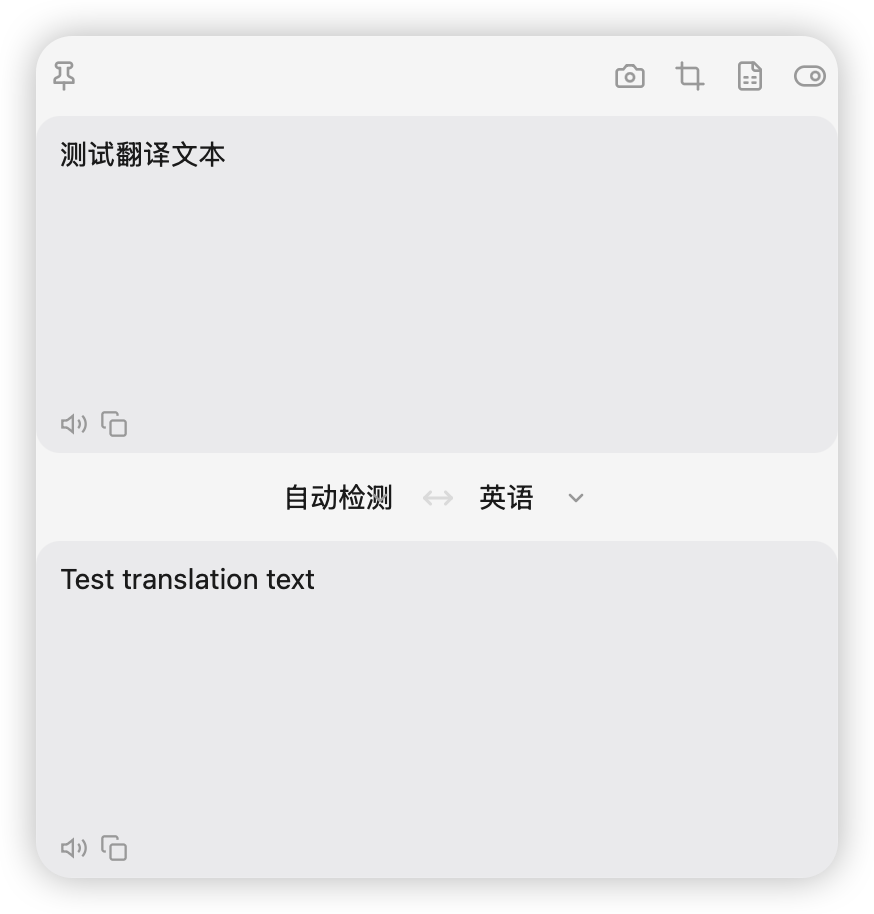
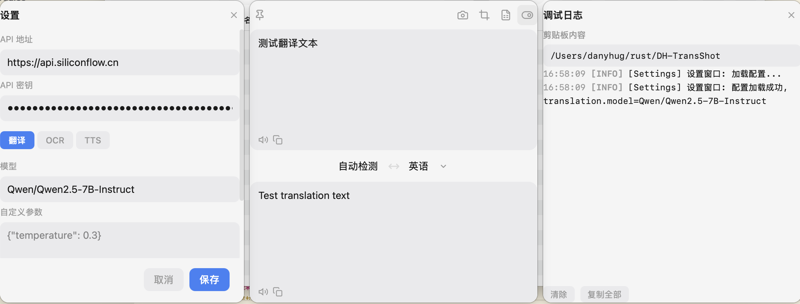

# DH-TransShot

[中文](README.md)

An all-in-one screenshot and translation desktop tool for macOS and Windows. **Powered by Vibe Coding.**


## Screenshots

| Translation View | Settings & Debug Log |
|:---:|:---:|
|  |  |

## Features

- **Region Screenshot** — Use a hotkey to select a screen area, auto-crop and copy to clipboard
- **Screenshot Annotation** — After capturing, enter annotation mode with rectangle, arrow, brush, and text tools; customize color, line width, and font size
- **Color Picker** — Hover over pixels during region selection to preview color values in real time; press `C` to copy the color to clipboard
- **Region Translation** — Select a region → OCR recognition → translation, all in one step
- **Translate Selected Text** — Hotkey to translate text selected by the mouse, no manual copy needed
- **Translate Clipboard** — One-click translation of clipboard text content
- **OCR Recognition** — Recognize text in images via vision LLM (OpenAI-compatible API)
- **Multi-language Translation** — Supports 14 languages including Chinese, English, Japanese, Korean, French, German, Spanish, Portuguese, Russian, Arabic, Italian, Thai, and Vietnamese
- **OpenAI-Compatible API** — Works with OpenAI, DeepSeek, Ollama, SiliconFlow, and any compatible service
- **TTS (Text-to-Speech)** — Read translation results aloud
- **Dark / Light Theme** — Automatically follows system preference
- **System Tray** — Runs in the background, always accessible
- **Independent Service Config** — Translation, OCR, and TTS can each be configured with separate API endpoints, keys, and models

## Hotkeys

| Hotkey | Action |
|--------|--------|
| `Alt+A` (macOS: `⌥A`) | Region Screenshot — select → annotate → copy to clipboard |
| `Alt+S` (macOS: `⌥S`) | Region Translation — select → OCR → translate → show result |
| `Alt+Q` (macOS: `⌥Q`) | Translate Selected Text — read selected text → translate → show result |

> The "T" button in the title bar translates clipboard content directly.

### Screenshot Annotation Tools

After selecting a region with `Alt+A`, annotation mode is activated. A toolbar at the bottom provides four tools:

| Key | Tool | Description |
|-----|------|-------------|
| `1` | Rectangle | Drag to draw a rectangle |
| `2` | Arrow | Drag to draw an arrow |
| `3` | Brush | Freehand drawing |
| `4` | Text | Click on the canvas to add text, press `Enter` to confirm |

Other actions: `Ctrl+Z` to undo, `Enter` to confirm screenshot, `Esc` to cancel. The right side of the toolbar lets you customize color, line width, and font size.

## Installation

### Download from Releases

Go to the [Releases](../../releases) page to download the installer for your platform:

- **macOS**: `.dmg` installer
- **Windows**: `.msi` installer

> macOS users need to grant permissions on first use in **System Settings → Privacy & Security**:
> - **Screen Recording** — Required for region screenshot and OCR
> - **Accessibility** — Required for "Translate Selected Text" (`Alt+Q`) to read selected text via Accessibility API
> - **Input Monitoring** — Improves global hotkey interception reliability and prevents Option+letter from occasionally typing special characters

### Build from Source

```bash
# Clone the repository
git clone https://github.com/danyhug/DH-TransShot.git
cd DH-TransShot

# Install frontend dependencies
pnpm install

# Run in development mode
pnpm tauri dev

# Build for production
pnpm tauri build
```

## Development Guide

### Prerequisites

- [Rust](https://rustup.rs/) (stable)
- [Node.js](https://nodejs.org/) >= 18
- [pnpm](https://pnpm.io/)
- macOS: Xcode Command Line Tools
- Windows: Visual Studio C++ Build Tools

### Common Commands

```bash
pnpm tauri dev          # Run in development mode
pnpm tauri build        # Build for production
pnpm exec tsc --noEmit  # TypeScript type check
pnpm exec vite build    # Build frontend only
cargo check             # Check Rust compilation (run from src-tauri/)
```

### Environment Variables

Copy `.env.test` to `.env` and fill in your API configuration:

```bash
cp .env.test .env
```

## Project Structure

```
src-tauri/src/
├── lib.rs                # Tauri Builder entry point
├── main.rs               # Application entry point
├── api_client.rs         # Shared HTTP client
├── commands/             # Tauri command layer (frontend-backend RPC)
│   ├── screenshot.rs     # Screenshot commands
│   ├── ocr.rs            # OCR commands
│   ├── translation.rs    # Translation commands
│   ├── tts.rs            # TTS commands
│   ├── clipboard.rs      # Clipboard commands (read, image copy, selected text)
│   └── settings.rs       # Settings commands
├── screenshot/           # Screenshot capture (xcap)
│   └── capture.rs
├── ocr/                  # OCR recognition (vision LLM)
├── translation/          # LLM translation (OpenAI-compatible API)
│   └── openai_compat.rs
├── tts/                  # Text-to-speech
├── config/               # Configuration & global state
│   └── settings.rs
├── tray.rs               # System tray
└── hotkey.rs             # Global hotkeys

src/
├── App.tsx               # Main window orchestration
├── ScreenshotApp.tsx     # Screenshot overlay entry
├── SettingsApp.tsx       # Settings window entry
├── DebugApp.tsx          # Debug window entry
├── components/           # UI components
│   ├── translation/      # Translation panel
│   ├── screenshot/       # Screenshot overlay
│   ├── settings/         # Settings panel
│   ├── debug/            # Debug log viewer
│   └── common/           # Shared components (title bar, etc.)
├── hooks/                # Business logic hooks
├── stores/               # Zustand state management
├── lib/                  # Utility functions
├── types/                # TypeScript type definitions
└── styles/               # Global styles
```

## Tech Stack

| Layer | Technology |
|-------|------------|
| Backend Runtime | Rust + Tauri v2 + Tokio |
| Frontend Framework | React 19 + TypeScript |
| Styling | Tailwind CSS v4 + CSS variable theming |
| State Management | Zustand (frontend) / Mutex\<T\> (backend) |
| Screenshot | xcap crate |
| OCR | Vision LLM (OpenAI-compatible API) |
| Translation | OpenAI-compatible Chat Completions API |
| Build | Vite multi-entry + Cargo |
| Package Manager | pnpm |

## License

[MIT License](LICENSE)
